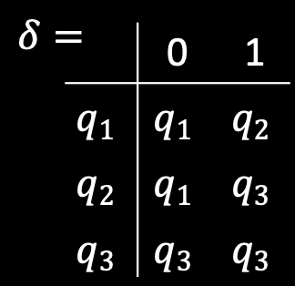

# Theory of Computing
## Terminology of automata

|표기 방법|예시|의미|
|-------|---|---|
|$q_n$|$q_1,q_2,q_3...$|state|
|$q_0$|$q_0$|start state|
|$w_i$|1|input symbol|
|$w$|1011101, $w_1w_2w_3w_4w_5$|string made of a sequence input symbols|
|$\varepsilon$|n/a|empty string|
|$\Sigma$|$\{0,1\}$|finite set of alphabets(types of symbols)|
|$L(M)$|$\lbrace w \|M\ accepts\ w \rbrace$|If string ends at accept state when we run the string at the automaton, we call the string is in language of machine.|
|$\emptyset$|$L(M)=\lbrace \rbrace =\emptyset$|Empty language: If the automaton doesn't accept any string, the language of machine is empty set|
|$Q$|$\lbrace q_1,q_2,q_3\rbrace$|Finite set of states|
|$\delta(q,a)$|  |Transition function: $q$: current state, $a$: symbol in a string|
|$F$|$\lbrace q_4,q_{21} \rbrace$|set of accept states|

* $M\ recognizes\ A$ 뜻: string을 따라 갔을때, accept state에서 끝난다.

## Automaton
* 어원적으로 "a self-acting machine"이라는 뜻이다.
