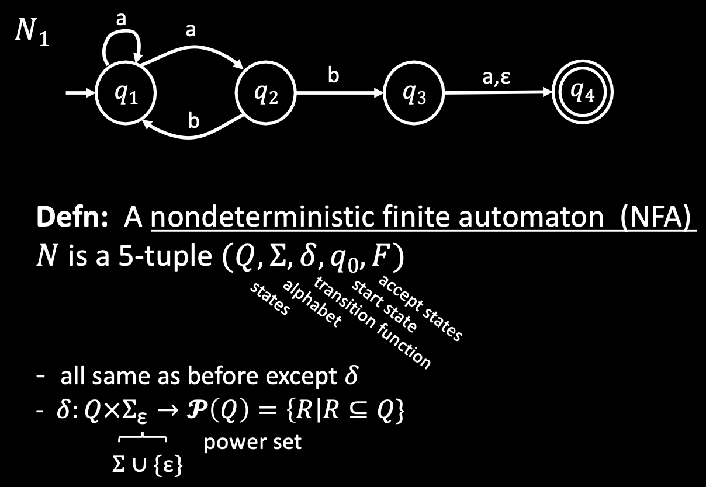

# Theory of Computing

## Terminology of automaton

|Notation|Example|Meaning|
|-------|---|---|
|$q_n$|$q_1,q_2,q_3...$|state|
|$q_0$|$q_0$|start state|
|$w_i$|1|input symbol|
|$w$|1011101, $w_1w_2w_3w_4w_5$|string: a sequence input symbols|
|$\varepsilon$|""|empty string: string of length 0|
|$\Sigma$|$\{0,1\}$|alphabets: a set of distinct types of input symbols|
|$L(M)$|$\lbrace w \|M\ accepts\ w \rbrace, \{01101,11001,110\} $|Language of $M$: Language is a set of strings that ends at accept state when we run on a automaton|
|Regular language|a|a|
|Non-regular langague|b|b|
|$\emptyset$|$L(M)=\lbrace \rbrace =\emptyset$|Empty language: If the automaton doesn't accept any string, the language of machine is empty set|
|$Q$|$\lbrace q_1,q_2,q_3\rbrace$|set of states|
|$\delta(q,a)$|$\delta:Q\times \Sigma \rightarrow Q$|Transition function: $q$: current state, $a$: symbol in a string|
|$F$|$\lbrace q_4,q_{21} \rbrace$|set of accept states|

* $M\ recognizes\ A$: When following the string in an automaton, it ends at accept state.

### Transition function example

## Regular operation

|Notation|Name|What it does|
|----|---|-----|
|$\cup$|union|Combining two languages(set of strings) to create one new language|
|$∘$|concatenation|Concatenate strings from the first language to second language. Order does matter: $A∘B \neq B∘A$|
|$^*$|star operation|generate the set of all possible combinations of elements in original set, including the empty set|

## Deterministic Finite Automaton(DFA)

* Finite automaton is $(Q,\Sigma,\delta,q_0,F)$ 5 tuple.
* Etymologically, it means "a self-acting machine"
* Automaton is singular and Automata is plural form of automaton.

## Nondetermistic Finite Automaton (NFA)

### Nondeterminism
* $\varepsilon$-transition: free movement without reading input symbol
* Accept string if <u>at least</u> one path ends at accept state

## Generalized Nondeterministic Finite Automaton (GNFA)

## Pumping Lemma

## Context Free Grammars (CFGs)

## Pumping Lemma for CFG

## Pushdown Automata (PDA)

## Turing machines (TMs)

## Multi-tape Turing machine

## Nondeterministic Turing machine

## Quantified Boolean Formula(QBF)

## Cook-Levin Theorem

## Space compexity (In depth needed)
* PSPACE

## Savitch's theorem

# L vs NL problem (Like P vs NP)
## Logarithmic space

## NL

## coNL